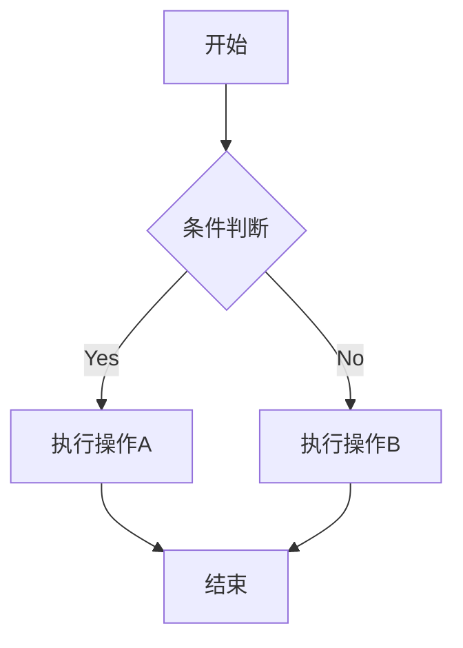

### 一.下载Chrome浏览器并将其设置为默认浏览器         
### 二.配置clash   
### 三.学会文件管理，专业性软件用英文命名
### 四.下载7-zip,everything,pixpin等工具
### 五.学习markdown

#### 1.标题

使用 # 号可表示 1-6 级标题，一级标题对应一个 # 号，二级标题对应两个 # 号，以此类推。

#### 2.文本格式

##### 换行

段落的换行是使用两个以上空格加上回车。

##### 字体

- **粗体语法**：使用两个星号 ** 或两个下划线 __ 包围文字

- **斜体语法**：使用一个星号 * 或一个下划线 _ 包围文字

- **粗斜体组合**：使用三个星号 *** 或三个下划线 ___

##### 分割线

你可以在一行中用三个以上的星号、减号、底线来建立一个分隔线，行内不能有其他东西。你也可以在星号或是减号中间插入空格

##### 删除线

如果段落上的文字要添加删除线，只需要在文字的两端加上两个波浪线 ~~ 即可

##### 下划线

下划线可以通过 HTML 的  标签来实现：

  

<u>带下划线文本</u>

  

##### 脚注

创建脚注格式类似这样 [^RUNOOB]。

  

[^RUNOOB]: 菜鸟教程 -- 学的不仅是技术，更是梦想！！！

  

##### 行内代码标记

使用一个反引号  包围代码

如：使用 `git commit` 命令提交代码

包含反引号的代码：当代码本身包含反引号时，使用两个反引号包围。

  

要显示反引号，使用 `` `code` `` 这样的格式

##### 文本高亮

常见语法（部分平台支持）：

  

这是==高亮文本==

  

HTML 替代方案：

  

这是<mark>高亮文本</mark>

##### 段落和换行

- 段落由一个或多个连续的文本行组成

- 段落之间由一个或多个空行分隔

- 普通段落不应该用空格或制表符缩进

-

有时需要在不创建新段落的情况下换行，Markdown 提供了几种方法：

  

方法一：行尾两个空格

在行尾添加两个或更多空格，然后按回车：

  

第一行内容（这里有两个空格）  

第二行内容

方法二：HTML 换行标签

  

第一行内容<br>

第二行内容

### 3.列表

##### 无序列表

无序列表使用星号(*)、加号(+)或是减号(-)作为列表标记，这些标记后面要添加一个空格，然后再填写内容

##### 有序列表

有序列表用于展示有顺序要求的步骤或项目。

  

有序列表使用数字并加上 . 号来表示

##### 任务列表

基本语法：

  

- [ ] 未完成的任务

- [x] 已完成的任务

- [ ] 另一个未完成的任务

### 4.引用块

##### 单级引用的使用

Markdown 区块引用是在段落开头使用 > 符号 ，然后后面紧跟一个空格符号

##### 多级嵌套引用

区块是可以嵌套的，一个 > 符号是最外层，两个 > 符号是第一层嵌套，以此类推

### 5.代码

##### 行内代码

如果是段落上的一个函数或片段的代码可以用反引号把它包起来（`）

##### 代码区块

代码区块使用 4 个空格或者一个制表符（Tab 键）。

### 6.链接

[链接名称](链接地址)

[链接文字](链接地址 "可选的标题")

### 7.图片


### 8.表格

Markdown 制作表格使用 | 来分隔不同的单元格，使用 - 来分隔表头和其他行。

  

语法格式如下：

  

|  表头   | 表头  |

|  ----  | ----  |

| 单元格  | 单元格 |

| 单元格  | 单元格 |

### 9.公式

$...$ 或者 \(...\) 中的数学表达式将会在行内显示。

$$...$$ 或者 \[...\] 或者 ```math 中的数学表达式将会在块内显示。

### 10.分割线

1、使用三个连字符：

  

---

2、使用三个星号：

  

***

3、使用三个下划线：

  

___

### 11.数学公式

基本运算符号

加减乘除：+, -, \times, \div

分数：\frac{a}{b} → $\frac{a}{b}$

根号：\sqrt{x}, \sqrt[n]{x} → $\sqrt{x}$, $\sqrt[n]{x}$

指数：x^2, e^{i\pi} → $x^2$, $e^{i\pi}$

比较符号

等于：=, \neq, \equiv → $=$, $\neq$, $\equiv$

大小：<, >, \leq, \geq → $<$, $>$, $\leq$, $\geq$

约等于：\approx, \sim → $\approx$, $\sim$

集合符号

属于：\in, \notin → $\in$, $\notin$

包含：\subset, \supset → $\subset$, $\supset$

交并：\cap, \cup → $\cap$, $\cup$

空集：\emptyset → $\emptyset$

### 12.流程图


### 六.下载hackbar插件
### 总结
学习了基本的下载软件，处理信息，电脑使用的基本操作和markdown的使用。