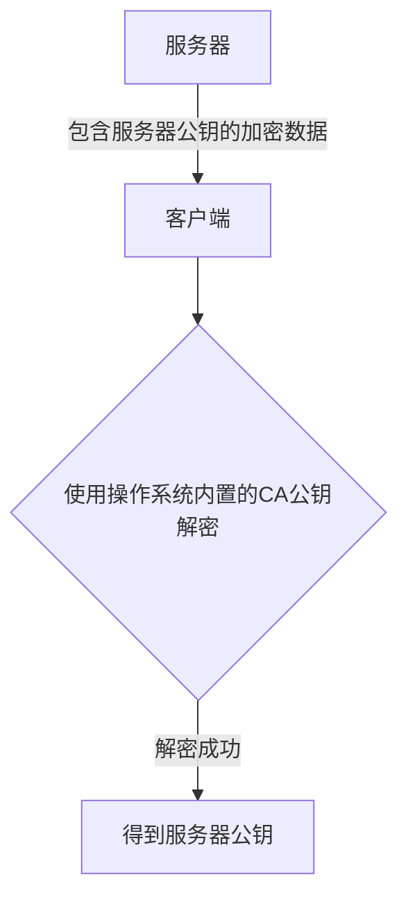
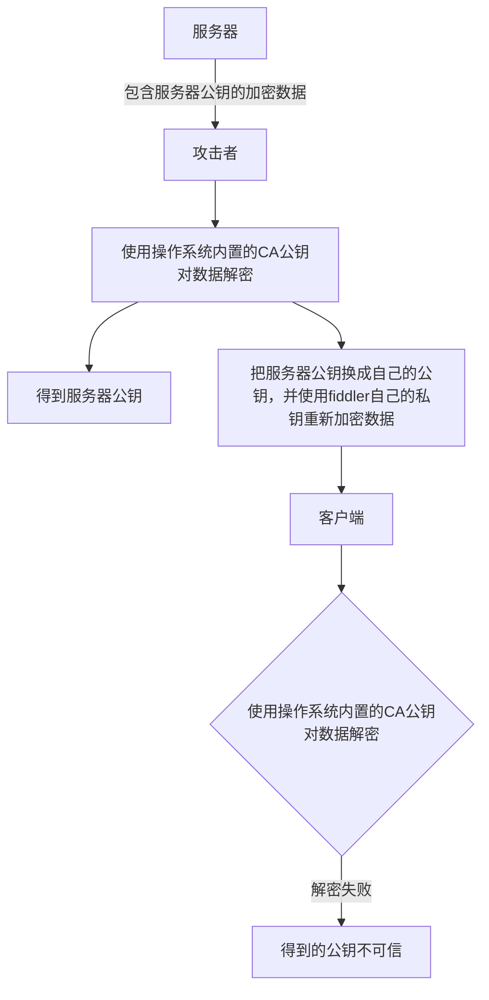
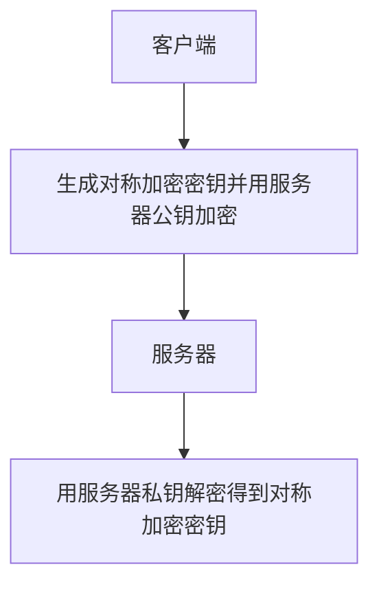

## 前置知识
### HTTP与HTTPS的区别
HTTP明文传输，数据都是未加密的，安全性较差。HTTPS(SSL+HTTP)数据传输过程是加密的，安全性较好。
HTTPS协议需要用到CA(Certificate Authority，数字证书认证机构)证书，HTTP连接速度要比HTTPS快，主要是因为HTTP使用TCP三次握手建立连接，客户端和服务器需要交换三个包，而HTTPS除了TCP握手的三个包，还需要SSL握手的九个包，所以共十二个包。
http和https的端口也不一样，http用的是80端口，https用的是443端口。
HTTPS其实就是建构在SSL/TLS之上的http协议。

注 : SSL（Secure Sockets Layer，安全套接字层）是一种用于保护互联网连接的加密安全协议。它在网站与浏览器（或两个服务器）之间创建加密通道，确保信用卡号、密码等敏感数据在传输时不被窃听或篡改。
### HTTP的通信过程
作为标准的C/S模型，http协议总是由客户端发起，服务器进行响应。
1. DNS解析，域名系统DNS将域名解析为IP地址。
2. 建立TCP连接，进行TCP的三次握手。
3. 浏览器发送请求。
4. 服务器响应浏览器，向浏览器发送数据。
5. 通信完成TCP连接关闭。
### HTTPS建立连接过程
1. 首先客户端给服务器发送一个请求。
2. 服务器发送一个SSL证书给客户端，内容包括：证书的发布机构，有效期，所有者，签名以及公钥。
3. 客户端验证数字证书的合法性。
4. 如果公钥合格，那么客户端会生成client key，一个用于对称加密的密钥，并用服务器的公钥对客户端的密钥进行非对称加密。
5. 客户端会再次发起请求，将加密之后的客户端密钥发送给服务器。
6. 服务器接受密文后会用私钥对其进行非对称解密，得到客户端密钥，并使用客户端密钥进行对称加密，生成密文并发送。
7. 客户端接收到密文，并使用客户端密钥进行解密，获取数据。
所以非对称加密只用在证书验证阶段，传输数据的加密用的是对称加密。
具体图解如下
### 公钥私钥
非对称加密最常见的就是RSA算法，他提供了两套密钥，**公钥和私钥**，二者并不相同，公钥用于加密，私钥用于解密。
即使有中间人获得了公钥，仍然无法破解，因为**公钥只能加密，不能解密**。公钥可以公开给所有人使用，只要保存好私钥即可。
## 中间人攻击初步理解
中间人攻击是指**攻击者**与**通讯的两端**分别创建独立的联系，并交换其所收到的数据，使通讯的两端认为他们正在通过一个私密的连接与对方直接对话，但事实上整个会话都被攻击者完全控制。
**HTTPS 使用了 SSL 加密协议，是一种非常安全的机制，目前并没有方法直接对这个协议进行攻击，一般都是在建立 SSL 连接时，拦截客户端的请求，利用中间人获取到 CA证书、非对称加密的公钥、对称加密的密钥**；有了这些条件，就可以对请求和响应进行拦截和篡改。
https虽然相对于http要安全，但还是可以通过中间人进行攻击。
## 中间人攻击具体过程
1. 服务器向客户端发发送公钥。
2. 攻击者截获公钥，留在自己手上。
3. 然后攻击者自己生成一个伪造的公钥，发送给客户端。
4. 客户端收到伪造的公钥后会生成一个密钥并用攻击者的公钥进行加密，发送给服务器。
5. 攻击者再次拦截，因为加密用的是攻击者的公钥，所以就可以用攻击者的私钥解密，从而获取客户端密钥。
6. 同时生成假的密钥，发送给服务器。
7. 服务器用私钥解密获得假的密钥。
8. 服务器用假密钥加密传输信息。

由于缺少对证书的验证，所以客户端虽然发起的是 HTTPS 请求，但客户端完全不知道自己的网络已被拦截，传输内容被中间人全部窃取。
防范方法：服务端在发送浏览器的CA证书中包含了非对称加密的公钥，
## 深入解析中间人攻击的流程
### 获取服务器公钥
首先在客户端和服务端建立HTTPS连接的初期，客户端和服务端经历了如下过程。

攻击者可以劫持服务器发送给客户端的加密数据，然后使用操作系统内置的CA公钥对数据解密，从而得到服务器公钥，并先将这个公钥保存起来。
攻击者会将解密出来的数据进行调包，将其中服务器返回的公钥替换成自己的一个公钥，然后使用自己的非对称加密的公钥对数据重新加密，并将这段重新加密后的数据返回给客户端。示意图如下：



用Fiddler自己的私钥加密后的数据，客户端肯定解密不出来呀，因为Fiddler的公钥并没有内置到客户端操作系统当中，所以我们一定要在手机上安装一个Fiddler提供的证书才行，只是为了让客户端能够解密出Fiddler调包之后的数据。这样就可以解密成功得到掉包后的公钥。
 这样客户端仍然获得了一个公钥，并且还以为这个公钥是服务器返回的，实际上这是一个被Fiddler调包之后的公钥。而服务器返回的真实公钥则被Fiddler保存了起来。
 到目前为止
 ```
 服务器 --> 一无所知
 Fiddler --> 保存着服务器返回的真实公钥
 客户端 --> 保存着Fiddler掉包后的公钥
 ```
### 客户端与服务器商定对称加密密钥
客户端可以利用随机算法在本地生成一个对称加密密钥，并用服务器返回的公钥进行加密，然后发送给服务器，由于公钥加密的数据只能用私钥解密，因此没有任何人能破解出客户端生成的对称加密密钥到底是什么。
然后服务器这边使用自己的私钥将客户端发来的数据进行解密，这样客户端和服务器就都知道对称加密的密钥是什么了，并且绝对没有第三个人能知道，这样双方之后都使用对称加密来进行通讯即可，从而保证了数据传输的安全。
示例图

然而现在有了Fiddler，一切就都不一样了。
 客户端这边拿到的其实根本就不是服务器的公钥，而是由Fiddler调包后的公钥。所以，客户端这边生成一个对称加密密钥后，使用的也是Fiddler调包后的公钥来进行加密的，这样这段加密后的数据只有用Fiddler自己的私钥才能解开。
 那么很显然，Fiddler当然是有自己的私钥的，因此它能够解密出这段数据，这样Fiddler就知道客户端生成的对称加密密钥是什么了。
  接下来不要忘记，Fiddler还在之前就保存了服务器返回的真实公钥，那么现在Fiddler可以用真实的服务器公钥再次加密这段数据，然后将加密后的数据发送给服务器。这样服务器还是可以正常用私钥解密，服务器没有任何察觉，但是密钥已经泄露了。
  到这里，对称加密密钥的商定过程也就结束了，目前各部分的状态如下：
```
服务器 --> 知道对称加密密钥
Fiddler --> 知道对称加密密钥
客户端 --> 知道对称加密密钥
```
之后客户端与服务器之间的所有通讯都会使用这个密钥加密后再进行传输，不知道密钥的人自然是无法解密出传输的内容的，但是Fiddler却知道密钥是什么，因此它可以完美监听客户端与服务器之间的通讯内容，也就实现了对https协议抓包的功能。
但是实现以上操作的前提是浏览器不进行证书检测或者浏览器认可Fiddler的证书。
## 如何防止中间人攻击
主要方法还是用CA证书验证，服务器向证书颁发机构（CA）提交公钥和相关信息，CA验证通过后颁发数字证书（包含服务器公钥、域名、有效期、CA签名等）。
这样的话
- 客户端连接服务器时服务器发送数字证书（公钥包含其中）。
- 客户端使用本地预装的CA根证书（信任锚）验证服务器证书的签名（通过哈希算法和CA私钥解密），确保证书未被篡改且由可信CA颁发。
- 若证书无效（如过期、域名不匹配、自签名证书），浏览器会警告用户。
## HTTPS抓包
HTTPS是可以抓包的，可以利用抓包工具，它的原理其实是模拟一个中间人。**通常 HTTPS 抓包工具的使用方法是会生成一个证书，用户需要手动把证书安装到客户端中**，然后终端发起的所有请求通过该证书完成与抓包工具的交互，然后抓包工具再转发请求到服务器，最后把服务器返回的结果在控制台输出后再返回给终端，从而完成整个请求的闭环。


## 参考文章
https://blog.csdn.net/qq_41220477/article/details/122708907   
https://cloud.tencent.com/developer/article/1849746
https://blog.csdn.net/ThinPikachu/article/details/123443911
https://github.com/Advanced-Frontend/Daily-Interview-Question/issues/142